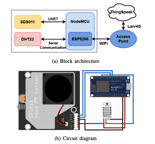
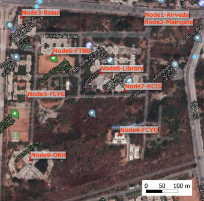
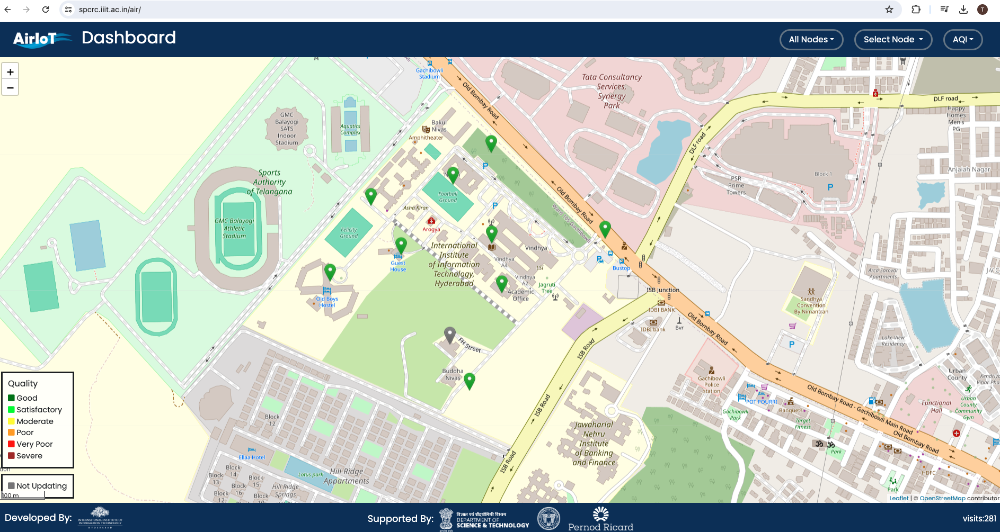

# Air Pollution Monitoring Project

## About the Project
This project, titled "Improving Spatio-Temporal Understanding of Particulate Matter using Low-Cost IoT Sensors," focuses on the deployment of low-cost Internet of Things (IoT) sensor nodes for monitoring particulate matter (PM) in urban environments. Our objective is to enhance the spatial and temporal resolution of air pollution data, which is crucial for making informed decisions on air quality management.

## Features
- **Dense Deployment**: Utilizes multiple sensor nodes to capture detailed spatial variations in particulate matter.
- **Real-Time Monitoring**: A web-based dashboard displays real-time data on particulate matter concentrations.
- **Data Analysis**: Performs correlation analysis and spatial interpolation to understand the dynamics of air pollution.

## Project Components
1. **Sensor Node Implementation**:
   - **NodeMCU Microcontroller**: Manages sensor data sampling and transmission.
   - **PM Sensors**: Measures particulate matter sizes PM2.5 and PM10.
   - **Temperature and Humidity Sensors**: Assists in adjusting PM readings based on environmental conditions.
   - 

2. **IoT Network Deployment**:
   - Deployed across a specific urban area to achieve high-density coverage.
   - 

3. **Process Flow**:
   - **Data Retrieval**: Both OpenStreetMap for map data and ThingSpeak for PM values use HTTP requests to retrieve necessary data.
   - **Data Handling**: The back-end, built with JavaScript, utilizes AJAX for asynchronous data fetching, allowing seamless interaction without reloading the webpage.
   - **Map Rendering**: Leaflet, a JavaScript library, takes the retrieved data and dynamically generates interactive maps on the front-end.
   - **Front-End Display**: The processed data is then presented through a well-structured HTML interface, providing users with real-time visual updates on air quality.

4. **Web-Based Dashboard**:
   - Real-time visualization of air quality data.
   - Accessible through any web browser.
   - 